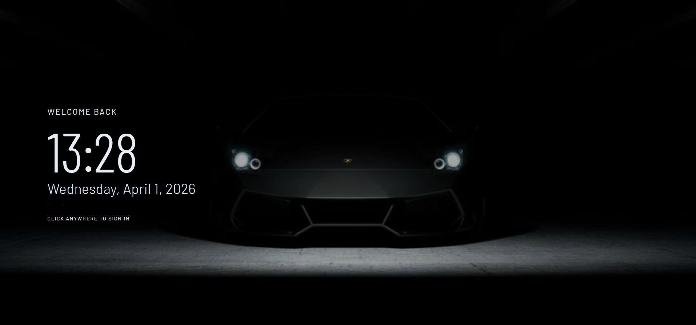

<p align="center">
  
</p>

# WebOS

WebOS is a Windows-inspired desktop experience built in React. It runs fully in the browser with a startup flow, desktop icons, draggable/resizable windows, taskbar interactions, and multiple built-in apps.

## Table of Contents

- [Overview](#overview)
- [Tech Stack](#tech-stack)
- [Features](#features)
- [How To Use](#how-to-use)
- [Run Locally](#run-locally)
- [Build For Production](#build-for-production)
- [Project Structure](#project-structure)
- [Collaboration](#collaboration)
- [License](#license)

## Overview

This project simulates an operating system interface in the browser, including:

- startup screens (boot, lock, login)
- desktop app launchers
- taskbar + start menu behavior
- multi-window app management
- utility and game apps

## Tech Stack

- React 19
- react-scripts 5
- JavaScript (ES6+)
- CSS
- react-icons

## Features

### System Experience

- Boot screen, lock screen, and login flow
- Desktop with draggable app icons
- Desktop right-click context menu
- Wallpaper switching support
- Brightness overlay support

### Window Management

- Open multiple apps simultaneously
- Focus active windows
- Drag windows to reposition
- Minimize, maximize/restore, and close
- Start maximized for selected apps

### Taskbar + Start Menu

- Pinned apps and running app indicators
- Overflow for extra pinned apps
- Start menu with search
- Recommended and pinned app launch entries
- Calendar panel from taskbar clock
- Developer info entry from Start menu
- Logout action from Start menu power button

### Built-In Apps

- File Explorer
  - folder navigation
  - create/rename/delete operations
- Notepad
  - open and edit text flows
- Focus App (Task Manager)
  - productivity/task-oriented workflow
- Chrome app shell
- Terminal app shell
- VS Code app shell (available in app registry)
- Paint (Draw)
- Slow Roads (embedded game)
- Minecraft Classic (embedded game)

## How To Use

### 1) Start the OS

- Run the app.
- Proceed through boot, lock, and login screens.

### 2) Use the Desktop

- Double-click a desktop icon to open an app.
- Drag icons to reposition them.
- Right-click desktop to open context actions.

### 3) Use Windows

- Drag title bar to move a window.
- Click maximize to switch between normal/maximized view.
- Click minimize to hide to taskbar.
- Click close to remove the app window.

### 4) Use the Taskbar

- Click a pinned app icon to launch/focus app.
- Use Start button for app search and quick launch.
- Use clock area to open calendar.
- Use Start menu power to logout.

### 5) Use File Explorer

- Browse folders from the explorer view.
- Create, rename, and delete entries.
- Navigate using explorer controls.

### 6) Use Games

- Open Slow Roads from desktop/taskbar icon.
- Open Minecraft from desktop/taskbar icon.
- Games are embedded in iframes and scale inside app windows.

## Run Locally

### Prerequisites

- Node.js
- npm

### Install and Start

```bash
git clone https://github.com/ponmanivasahan/WebOS.git
cd WebOS
npm install
npm start
```

The app starts in development mode on your local server.

## Build For Production

```bash
npm run build
```

Production files are generated in the `build/` folder.

## Project Structure

```text
src/
  assets/
  components/
    apps/
      DesktopApps/
      FileExplorer/
      Games/
      Notes/
      TaskManager/
    desktop/
    welcome/
    window/
  context/
  hooks/
```

Main entry files:

- `src/index.js`
- `src/App.js`

## Collaboration

If you want to collaborate on this project, DM me on Slack:

- `vasupks01`

## License

This project is licensed under the GNU General Public License v3.0 (GPL-3.0).
Sorry if it didn't work

See the LICENSE file for details.
